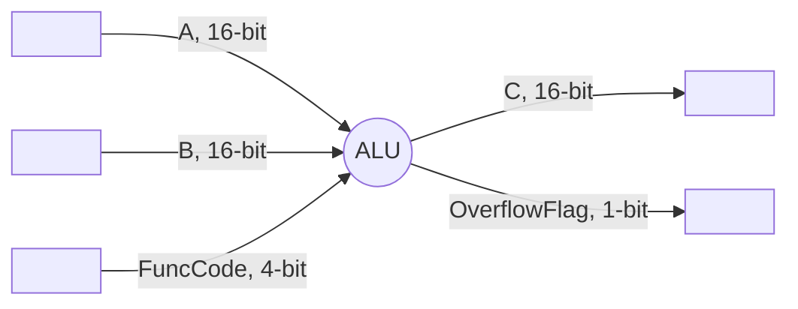
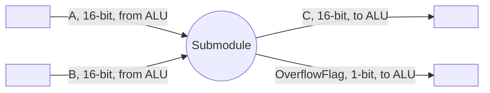

Lab 1: ALU
===
20190084 권민재 `CSED311`

# Introduction
이번 Lab에서는 Verilog에서 ALU (Arithmetic Logic Unit)을 구현해야 한다. 입력으로는 operand (16-bit Signed Binary) 2개와 funccode(4-bit binary)가 주어진다. 해당 입력에 대해 이 프로그램은 funccode에 상응하는 연산을 수행하고 그 결과값을 16-bit signed binary로 반환하여야 하며, 필요하다면 Overflow Flag 또한 설정해주어야 한다. 이번 Lab을 통해 기본적인 Verilog의 사용법을 익히고, 그를 이용하여 아키텍쳐 레벨에서의 ALU를 알아볼 것이다.

구현해야할 ALU의 사양은 아래 표와 같으며, Overflow Flag는 덧셈과 뺄셈에서 오버플로우가 발생한 것이 아니라면 기본적으로 0으로 세팅된다.

| FuncCode   |      Operation      |  Comment|
|:----------:|:-------------:|:------|
| 0000 | `A + B` | Signed Addition |
| 0001 | `A - B` | Signed Subtraction |
| 0010 | `A` | Identity |
| 0011 | `~A` | Bitwise NOT |
| 0100 | `A & B` | Bitwise AND |
| 0101 | `A | B` | Bitwise OR |
| 0110 | `~(A & B)` | Bitwise NAND |
| 0111 | `~(A | B)` | Bitwise NOR             |
|   1000   |  `A ⊕ B`   | Bitwise XOR             |
|   1001   | `~(A ⊕ B)` | Bitwise XNOR            |
|   1010   |  `A << 1`  | Logical Left Shift      |
|   1011   |  `A >> 1`  | Logical Right Shift     |
|   1100   | `A <<< 1`  | Arithmetic Left Shift   |
|   1101   | `A >>> 1`  | Arithmemtic Right Shift |
|   1110   | `~A + 1` | Two's Complement |
| 1111 | `0` | Zero |

# Design

## Submodules

우선, 처리해야할 모든 연산을 하나씩 모듈으로 제작하여 총 16개의 Submodule을 만들었다. 각 모듈은 입력부에 Top-level Module (ALU)로부터 A와 B가 연결되어 ALU의 입력을 전달받는다. Operand를 1개만 요하는 경우에는, 해당 submodule에 B를 연결하지는 않았다. 해당 입력으로부터 각 모듈이 처리해야할 연산을 수행한 후, ALU에 연결되어 있는 C로 그 결과값을 내보낸다. 덧셈과 뺄셈을 수행하는 모듈의 경우, 추가적으로 Overflow Flag 또한 ALU에 연결하여 ALU로 Overflow Flag를 내보낼 수 있도록 디자인하였다.

대부분의 연산은 Verilog의 기본 연산자를 이용해도 가능하지만, Add와 Sub의 경우에는 Overflow Flag를 세팅하기 위해 그를 확인하는 과정이 필요하며, ARS의 경우에는 부호 비트를 복사할 수 있도록 구현해야 할 것이다.

## ALU

ALU는 submodule들을 조합하여 원하고자 하는 기능을 구성할 것이다. 입력되는 A, B는 모두 submodule들의 입력부에 연결되어야 한다. 다만, 경우에 따라 operand가 1개인 module은 A 1개만 연결하였다. 그리고 각 모듈의 출력에 대응하는 와이어를 만들어서 각 모듈에 연결하도록 디자인 하였으며, 덧셈과 뺄셈의 Overflow Flag를 받아올 와이어를 각각 1개씩 설정하여 연결하도록 디자인했다.

위와 같이 구성한 회로에서, `always` 를 이용하여 신호가 주어질 때에 FuncCode에 따라 submodule의 계산 결과를 C로 내보낼 수 있도록 디자인하였다. 또한, 경우에 따라 Add와 Sub 모듈의 Overflow Flag 또한 ALU에서 출력할 수 있도록 했다. 다만, Add의 FuncCode가 `0000`이기 때문에 ALU에 신호가 들어왔는지 그 여부를 FuncCode의 신호 여부로만 확인하면 안되며, FuncCode, A, B 모두의 신호를 점검해야한다.

# Implementation

## ALU

ALU에서는 우선 각 submodule을 아래와 같은 경우로 나눠서 연결했다.

| Case                              | Impl.                                                        |
| --------------------------------- | ------------------------------------------------------------ |
| 2 Operands, Overflowable          | ALU의 입력으로 들어오는 A, B를 submodule 입력 A, B에 연결  각 submodule마다 ALU에 서브모듈 출력을 받아올  `wireOut` 을 만든 후, submodule의 출력 C를 `wireOut`에 연결 각 submodule마다 ALU에 서브모듈 overflow flag의 출력을 받을 `wireOutOverflowFlag`를 만든 후,submodule의 Overflow Flag 출력을 `wireOutOverflowFlag`에 연결 |
| 2 Operands, Overflow Not Possible | ALU의 입력으로 들어오는 A, B를 submodule 입력 A, B에 연결  각 submodule마다 ALU에 서브모듈 출력을 받아올  `wireOut` 을 만든 후, submodule의 출력 C를 `wireOut`에 연결 |
| 1 Operand                         | ALU의 입력으로 들어오는 A를 submodule 입력 A에 연결  각 submodule마다 ALU에 서브모듈 출력을 받아올  `wireOut` 을 만든 후, submodule의 출력 C를 `wireOut`에 연결 |

이후, `always` 를 이용해 ALU에 `A`, `B` 또는 `FuncCode`에 신호가 들어왔을 때 주어지는 연산을 수행할 수 있도록 구현하였다. 이때, `FuncCode` 중 `0000` 가 존재하기 때문에, `FuncCode`의 신호 여부만으로 연산을 수행 여부를 확인하는 것이 어렵기 때문에  `A`, `B` 또는 `FuncCode` 의 신호 여부를 모두 확인해주었다. 신호가 들어왔을 경우, `case` 를 이용하여 각 `FuncCode` 마다 ALU의 출력 포트 `C` 에 적절한 서브모듈의 `wireOut`이 연결되도록 출력부를 구성했다.

## Submodules

### 2 Operands Modules

2개의 입력값을 가지는 경우에는 입력값 A, B에 대해 Verilog의 기본 연산자를 이용하여 연산을 수행한 후 그 값을 출력 C에 assign 하는 방식으로 구현되었다. 이때, 덧셈과 뺄셈의 경우에는 Overflow Flag를 설정해야 했기 때문에, 다른 모듈과는 다르게 구현되었다.

##### ADD, SUB

덧셈과 뺄셈의 경우에는 주어진 입력값을 처리하는 것은 물론이고, 더불어 Overflow Flag 또한 처리해야한다. 해당 플래그는 Overflow가 발생했을 때에는 1, 그 외에는 0이 되어야한다. 이것은 입력과 연산 결과의 부호 비트의 차이를 통해 알아낼 수 있다. ADD 모듈에서는 부호가 같은 두 입력값의 처리 결과가 입력의 부호와 달라졌을 때 플래그가 1이 되도록 하여 오버플로우 플래그를 구현했다. 이와 유사하게, SUB 모듈에서는 부호가 다른 두 입력값의 처리 결과가 A의 부호와 달라졌을 때 플래그가 1이 되도록 구현하였다. 연산 결과는 다른 모듈과 같이 출력 C에 연결했으며, OverflowFlag 또한 다른 출력에 연결하여 내보낼 수 있도록 구성하였다.

### 1 Operand Modules

1개의 입력값을 가지는 경우에는 입력값 A에 대해 Verilog의 기본 연산자를 이용하여 연산을 수행한 후, 그 값을 출력 C에 assign 하는 방식으로 구현되었다. 이때, ARS의 경우에는 기본 연산자로 수행할 수 없기 때문에 직접 구현해주었으며, ZERO나 ID의 경우에는 연산을 하지 않아도 되기 때문에, 여타 연산에 필요한 연산자를 사용하지는 않았다.

##### ARS

Arithmetic Right Shift (이하 'ARS')의 경우에는 여타 shift 연산과는 다르게, shift를 하는 경우에 MSB를 복제해주어야 한다. 그래서 나는 concat을 이용하여 출력 C에 `{A[data_width-1], A[data_width-1:1]}` 를 할당하는 방식으로 MSB를 복제하게 구현하였다.

# Discussion

- 과도한 모듈화
    - 모듈화를 진행함에 있어서, 모든 연산을 각각 1 모듈로 치환하였기 때문에 많은 수의 모듈이 생기게 된다. 각 submodule 내 에서 실제로 처리해야할 연산량에 비해서는 많은 submodule이 있기 때문에 상당히 비효율적이라는 것을 알 수 있다. 그렇기 때문에 단순한 연산은 모듈을 사용하지 않고, ALU의 내부에서 처리해도 될 것이라고 생각한다.
- ARS
    - 직접 concat을 이용하는 방향으로 ARS를 구현하였지만, ARS 모듈의 입력 포트에서 `input wire signed A[data_width-1:0]` 과 같이 선언해주었다면, Verilog의 기본 연산자인 `>>>`를 이용해서 ARS를 구현할 수 있었을 것이다.

# Conclusion

이번 과제에서 Verilog를 이용하여 ALU를 구현해 볼 수 있었다. 이번 과제를 직접 구현해보고 Discussion 해봄으로써, Verilog와 많이 친숙해질 수 있었다. 또한, submodule들을 만들고 Top-Level 모듈에서 submodule들을 연결하는 방식으로 시스템을 구성할 수 있다는 것을 알 수 있었다. 