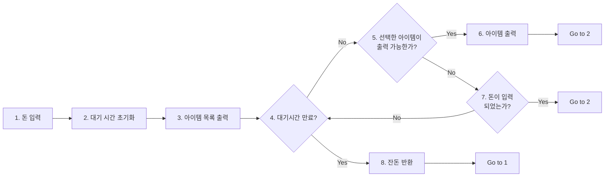
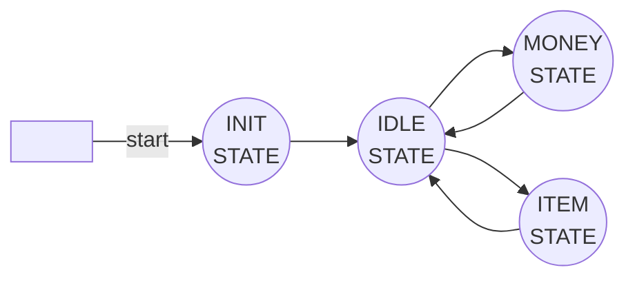

Lab 2: RTL Design
===
20190084 권민재, 20190335 양승원 `CSED311`

# Introduction
<!--
- What you have to design & implement
- What you have to learn
-->
이번 Lab에서는 RTL, 즉 Synchronous Circuit으로 Vending Machine을 구현해야 한다. 이 회로에는 사이클마다 입력되는 동전의 종류, 선택한 아이템 종류, 동전 반환 여부가 입력되며 그 입력에 상응하여 가능한 아이템들, 배출한 아이템, 반환하는 동전을 출력해야한다. 이것은 FSM의 형태로 몇 가지 state를 만들어서 구현할 것이다. 이 과제를 통해 Verilog를 이용하여 Synchrounous Circuit을 다루는 방법을 알아볼 것이다.

# Design
<!--
You should make an effort to write this section.
- How to divide a large module into submodules?
- How does each submodule operate?
- How to interconnect them?
If necessary, add a diagram to your report (handwritten diagram is also allowed)
-->

## Submodules
### caculate_current_state

이 모듈에서는 위와 같은 FSM에 따라서 다음 state를 계산하고, 현재 state에서 처리해야 할 일을 수행하도록 디자인했다. **INIT STATE**는 vending machine의 초기 state로 지금까지 입력된 동전, 출력한 액수, 반환한 동전의 총합을 0으로 초기화 한다. **IDLE STATE**는 vending machine이 대기하는 state로, available 아이템을 출력하며 반환하는 동전이 있다면 해당 동전의 액수만큼을 반환한 동전의 총합에 더하는 역할을 수행한다. **MONEY STATE**는 돈의 입력을 처리하는 상태로, 돈이 입력될 때 해당 액수만큼을 입력된 동전의 총합에 더한다. 마지막으로, **ITEM STATE**는 아이템을 출력하는 상태로, 선택한 아이템이 available하다면 해당 아이템을 출력한다.
맨 처음에 INIT STATE를 벗어난 이후에는 IDLE, MONEY, ITEM STATE들을 오가면서 vending machine이 작동할 수 있도록 디자인하였다. 입력되는 동전이 있을 경우에는 MONEY STATE, 선택한 아이템이 있을 경우에는 ITEM STATE, 그 외 경우에는 IDLE STATE에 있도록 state를 계산하게 디자인하였다.

### check_time_and_coin
이 모듈에서는 입력이 들어오지 않을 때 wait_time을 감소시킨다. 정해진 시간이 지날 때까지 입력이 들어오지 않거나 return_trigger가 눌리면 돈을 반환한다.

돈이 입력되거나 아이템을 요청받으면, valid한 요청에 한해 wait_time을 초기화한다. 입력된 돈을 총합에 더하거나 아이템을 내보내는 역할을 위의 `calculate_current_state`에서 수행하기 때문에 할 필요가 없다.

그러나 돈을 반환할 때에는, 모든 금액을 전부 반환할 때까지 한번에 얼마나 돈을 반환해야하는지 결정해야한다.

### change_state
`calculate_current_state`에서 state를 변경해야함을 알리면, 이 모듈은 실제로 state를 변경한다.

## Top-level module
Top-level module, Vending Machine에서는 위의 submodule들을 조합하는 방식으로 디자인하였다.

# Implementation
<!--
You should explain your Verilog code.
- The overall structure of your implementation
- A short, but meaningful description for non-trivial modules.
- The interaction between modules when they run a given scenario.
- Do NOT explain too much details of your implementation.
- Do NOT show the waveform results.
-->
## Submodules
### caculate_current_state
이 모듈에서는 `1. 다음 state를 계산하고`, `2. 현재 state에서의 output` 을 계산하기 위해 크게 2개의 Combinational Logic을 구성하여 구현하였다.
#### Combinational logic for the next states
| Input | Process |
| :------: | -------- |
| `i_input_coin` | 다음 state를 MONEY STATE로 설정하도록 구현했다.|
| `i_select_item`| 다음 state를 ITEM STATE로 설정하였다.|
| 그 외의 경우      | 다음 state를 IDLE STATE로 설정하였다. |

#### Combinational logic for the outputs
|State|Process|
|:---:|:-----|
|INIT| 돈 관련 각종 누산기들을 초기화한다.|
|IDLE| `available_item`을 출력하고, return_coin을 누산한다.|
|MONEY|`i_input_coin`에 따라서 입력된 동전의 총액을 누산한다.|
|ITEM|`i_select_item`에 따라서 돈이 충분할 경우에 해당 아이템을 출력하고, 출력 금액을 누산한다.|

### check_time_and_coin
#### Combinational logic for coin input
`i_input_coin`으로 입력이 들어왔다면, `wait_time`을 초기화한다.

#### Combinational logic for item output
`i_select_item`으로 입력이 들어왔다면, 현재 잔액인 `balance_total`과 해당 아이템의 가격을 비교한다. valid하다면, `wait_time`을 초기화한다.

#### Combinational logic for wait time
`wait_time`이 모두 지나가서 음수가 되었거나, 잔액 반환을 위해 `i_trigger_return`이 눌렸다면, 반환할 금액을 계산하기 시작한다.

반환할 금액은 `coin_value` 배열에서 큰 금액부터 차례대로 추가하며, 잔액(`balance_total`)과 이번 클락에서 반환할 금액(`_tmp_return`)을 비교하여 가능한지 검사한다.

#### Sequential logic for wait time
Reset 버튼이 눌리면 `wait_time`과 `return_coin`을 초기화한다.
그렇지 않은 경우, `wait_time`을 1 감소시킨다.

### change_state
STATE(`current_total`)를 관리하는 Sequential Logic 하나가 존재한다.
Reset 버튼이 눌리면 STATE_INIT이 되고, 아니라면 `current_total_next`에 있는 STATE값을 가져온다.

# Discussion

<!--
- write anything valuable that you want to inform
For example:
- Important decisions you made
- Difficulties in designing and implementing, and your solutions for these
- Differences between your design and implementation, and the reasons for these.
- Feedback to TAs
-->
- 처음에는 돈을 받는 STATE와 물건을 반환하는 STATE 2개로 설계하였다. 하지만 이후 total 금액 초기화를 위해 INIT STATE를 추가하고, 기다리는 상태를 표현하기 위해 IDLE STATE를 추가하면서 STATE를 4개로 쪼개서 만들게 되었다.
- `wait_time`이 음수임에도 반환이 작동하지 않는 것을 발견했는데, 저번 arithmetic shift 때와 마찬가지로 signed형으로 변환하여 해결할 수 있었다.

# Conclusion

<!--
don’t need to repeat the contents of the introduction section.
Just answer the following question:
- Did you succeed in achieving the goals described in the introduction section?
- If not, which goals could not be achieved? Why?
-->
이번 Lab을 통해 Verilog로 Synchronous Circuit을 이용한 FSM을 구현해보며 클럭에 따라 비동기적으로 처리되어야 할 상황에서 어떻게 해야하는지 배울 수 있었다. 