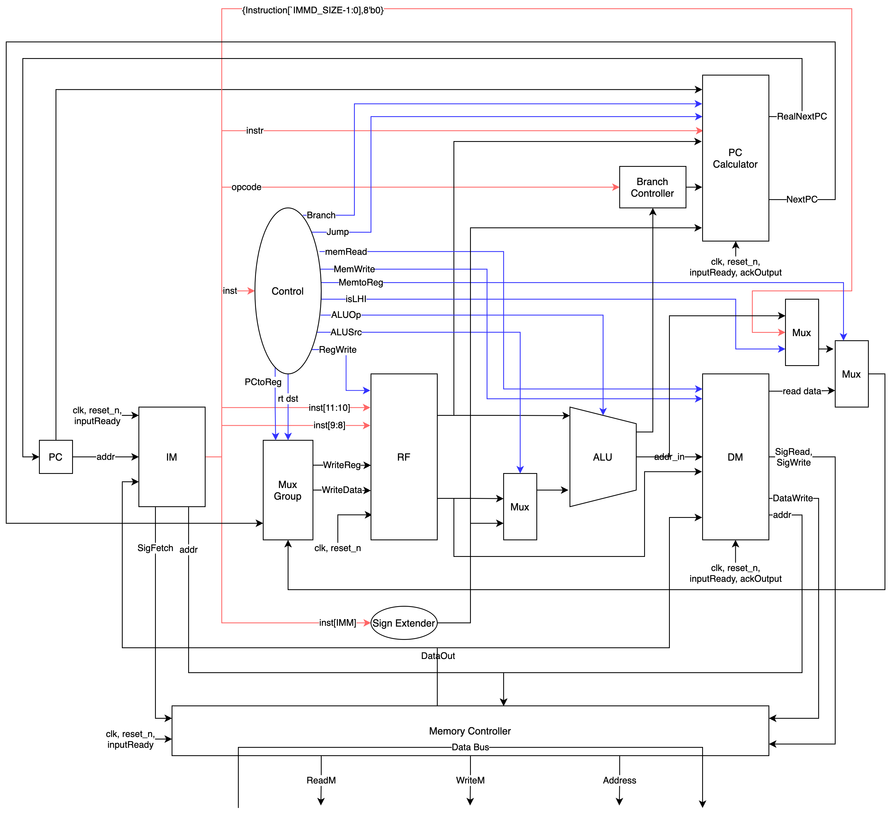

Lab 3: Single Cycle CPU
===
20190084 권민재, 20190335 양승원 `CSED311`

# Introduction
이번 과제에서는 Verilog를 이용하여 간단한 single-cycle TSC CPU를 구현해야한다. RISC-V에 비해 간단한 ISA를 가지는 CPU이며, 레지스터는 4개 메모리를 이용하여 인스트럭션을 처리하도록 구현해야 한다. 인스트럭션에는 R, I, J type이 존재한다.

이번 과제를 통해 CPU의 전반적인 구조, datapath의 구성, 그리고 control unit에 대해 알아볼 것이다.

# Design

우리는 크게 Instruction을 가져오는 모듈, 레지스터를 관리하는 모듈, ALU 연산을 수행하는 모듈, 데이터를 메모리에 읽고 쓰는 모듈, PC를 관리하는 모듈을 구성한 뒤, 이 모듈들을 Control Unit에서 시그널을 통해 운용하는 방식으로 큰 틀을 잡았다.

## Instruction Memory
Instruction Memory는 메모리로부터 인스트럭션을 fetch하여 저장하는 역할을 수행한다. 매 클럭의 posedge마다 fetch signal을 memory controller에 전송하여 instruction을 가져오도록 한다.

## PC Caculator
PC Calculator는 PC 값의 설정을 담당한다. 일반적인 경우 PC는 1 증가하게 되지만, Branch Condition을 만족하거나 Jump하는 경우에는 PC값에 추가 연산을 통해 구한 특정 주소값을 넣어야 한다.

## Control Unit
주어진 Instruction에 대해 다른 모듈들이 어떤 입력을 받아서 어떤 동작을 해야하는지 구체적으로 정해주는 모듈이다. 메인 컨트롤 유닛에서 Mux들의 Selector를 관리하며, 부가적인 메모리 메모리 관련 시그널을 RF나 DM에 전송하여 메모리 입출력이나 레지스터 RW에 도움을 주도록 설계하였다. 아래와 같은 시그널들을 전송할 수 있도록 설계하였다.
- 분기 여부를 결정하는 시그널
- 점프 여부를 결정하는 시그널
- 메모리 읽기 혹은 쓰기 여부를 결정하는 시그널
- LHI 여부를 결정하는 시그널
    - LHI의 경우, 그 연산이 단순한 concat이므로 ALU에서 처리하지 않고 Mux를 통해 처리하도록 설계하였다.
- ALU Operator를 결정하는 시그널
- ALU Source를 정하는 시그널
- Register에 Write해야하는지 그 여부를 결정하는 시그널
- PC의 값을 register에 써야하는지 그 여부를 알려주는 시그널
- rt의 destination 을 결정하는 시그널

## Register File
register를 관리하는 모듈이다. 입력으로 들어온 register index에 맞는 값을 출력한다. 매 클럭의 posedge마다 필요한 경우 write back을 수행하여 다음 instruction에서 새로 바뀐 register 값을 사용할 수 있도록 한다.

## Sign Extender
I-type instruction을 통해 입력되는 immediate 값이 레지스터와 크기가 맞지 않기 때문에, sign extender를 이용하여 비트 수를 맞추어야 한다.

## Adder
단순히 두 입력 값을 더한 값을 출력하는 모듈으로, PC를 계산하는데 사용될 것이다.

## Muxes
Mux는 Control signal에 따라 입력에 들어가는 값을 둘 중에 골라주는, 약방의 감초 같은 모듈이다. 3개 중 1개, 4개 중 1개를 선택하는 Mux를 제작하려고 하였으나, 필요치 않다고 생각되어서 2개 중 1개를 선택하는 Mux만 제작하였다.

## ALU
ALU는 CPU에서 기본적인 연산을 담당하는 모듈이다. 입력값 두 개에서 주어진 연산을 수행한다. Branch Controller Unit에서 분기 주소를 알 수 있게 하기 위해, 뺄셈 연산도 수행한다.

## Branch Controller Unit
Branch Controller Unit에서는 `BNE`, `BEQ`, `BGZ`, `BLZ` 와 같은 opcode가 주어졌을 때 조건에 따른 분기를 수행한다. 기본적으로 Control Unit에서 branch 시그널을 받으며, ALU에서 보내는 시그널도 받는다. 주어진 opcode와 ALU에서 보낸 시그널에 따라 브랜치 여부를 결정한다.

## Data Memory
Data Memory에서는 인스트럭션에서 주어진 대로 데이터를 메모리로부터 읽거나 쓰는 역할을 수행한다. 인스트럭션에 따라 주어지는 Control Unit의 신호와 메모리로부터의 정보를 활용하여 Memory Controller에 신호를 보내도록 설계했다.

## Memory Controller
Memory Controller는 메모리를 관리하는 모듈이다. 이 과제에서는 메모리에 inout 버스를 통해 접근해야하기 때문에, 효율적인 접근 및 관리를 위해 모듈의 형태로 추상화시키는 방법을 택했다. 이 모듈은 fetch, read, write에 대한 signal을 받아서 각 신호의 경우에 맞게 데이터 읽기 및 쓰기를 처리하도록 설계했다.

# Implementation

## Instruction Memory
`posedge`에서 `sig_fetch`를 켜면, memory_io(memory controller) 모듈을 통해 `data`에 fetch한 instruction이 들어올 것이다. 그러고 나면 입력을 받아가도 된다는 의미에서 `input_ready`가 켜지는데, 이 때 `instruction` reg로 값을 받아오면 된다. `input_ready`가 한번 켜지고 꺼질 때, 즉 `input_ready`가 `negedge`일 때 값을 받아오도록 했는데, 혹시 모를 race condition을 예방하기 위해서이다.

## PC Caculator
`AdderNextPC`는 현재 실행 중인 instruction을 가리키는 PC의 바로 다음 instruction을 가리키는 `next_pc`값을 연산한다. `AdderBranch` 모듈은 PC값에 immediate 값을 더하여 분기 주소를 계산한다. `jump_target_address`는 PC값의 상위 4비트와 `target_offset` 12비트를 concat하여 계산한다.

2개의 mux, `MuxBranch`와 `MuxJump`는 계산된 3가지 PC 중에서 정말 다음 PC가 될 값을 선택하여 `real_next_pc`로 내보낸다. Main Control Unit에서`jump`를 켠 경우 `jump_target_address`가, `branch`가 켜져있고 branch_controller에서 계산한 결과 `branch_cond`까지 만족하는 경우 `branch_address`가 output이 된다. 이 외의 경우 `next_pc`가 output이 된다.

모두 combinational logic이다.

## Control Unit

| control signal | role |
| --------   | -------- |
| rt_dest    | I-type instruction의 경우 $rd가 아닌 $rt에 write해야한다. |
| alu_src    | alu의 한 입력으로 레지스터 대신 immd 값을 준다. |
| is_lhi     | LHI instruction의 경우 immd 값을 상위 값으로 갖는 값을 write해야한다. |
| reg_write  | register writeback을 수행한다. |
| mem_read   | memory read를 수행한다. |
| mem_to_reg | alu output 대신 memory read 결과를 writeback으로 넘긴다.  |
| mem_write  | memory write를 수행한다. |
| PCtoReg    | PC 값을 $2에 write하는 instruction(`JAL`, `JRL`)이 있다. |
| jp         | jump한다. |
| branch     | branch condition이 만족되는 경우 분기한다. |

## Register File
16비트짜리 레지스터 4개를 배열의 형태로 저장한다. clk의 posedge에서 sequential logic이 register write를 수행한다.

combinational logic은 항상 register read를 수행하고 있다.

## Sign Extender
immediate 값을 signed value로 보고 다시 대입하면 간단하게 sign extend를 할 수 있다.

## Adder
combinational logic이 두 입력값을 더한 결과를 항상 이어준다.

## Muxes
selector 값에 따라 두 input 중 하나가 combinational logic을 통해 output으로 출력된다.

## ALU
두 값을 입력 받은 후, Control Unit에서 주어지는 function code에 따라 주어지는 연산을 수행한다. 다만, `BNE`, `BEQ`, `BGZ`, `BLZ`와 같은 조건에 따른 분기를 수행하기 위해서 주어진 연산 뿐만 아니라 첫번째 값에서 두번째 값을 뺀 값 또한 출력하도록 설계하였다. 해당 값은 Branch Controller Unit으로 이어진다.

## Branch Controller Unit
`BNE`, `BEQ`, `BGZ`, `BLZ` 각각에 대해, ALU를 통해 들어온 `sub_input` 값이 branch condition이 참이 되도록 하는 값인지 판단하여 분기 여부를 결정한다.

## Data Memory
memory read와 write는 모두 negedge clk에서 처리했는데, 이는 posedge clk에서 instruction fetch가 시작되기 때문에, posedge clk에는 메모리에 어떤 값을 읽고 쓸지 아직 결정되지 않았기 때문이다.

`sig_read`와 `sig_write`는 뒤의 memory controller(memory_io)에서 받아가서 실제 데이터 in/out을 수행하게 된다.
`input_ready`가 켜지면 read가 끝났으므로 `sig_read`를 초기화하고, `ack_output`이 켜지면 write가 끝났으므로 `sig_write`를 초기화하는 것은 이곳에서 수행한다. 물론 insturction memory 쪽에서 instruction fetch를 하면서 `input_ready`가 켜질 수도 있겠지만, 두 작업이 동시에 발생하지 않는 것에 더해 0으로 초기화하는 작업이기에 문제가 되지 않는다.

## Memory Controller
instruction memory에서는 `sig_fetch`를, data memory에서는 `sig_read`와 `sig_write`를 전달받는다. 이에 따라, 실제로 외부의 magic memory와 통신하는 수단인 `read_m`과 `write_m`을 조절한다.

결과 값이 돌아온 것이 `input_ready`를 통해 확인되면, `data_out`에 `data` 값을 저장함으로써 각 메모리 모듈에도 값을 전파하게 된다.

# Discussion
* 처음에는 ALU Control Unit을 추가하려고 하였다. 그러나 RISC-V 아키텍쳐와 달리 I-type 연산들의 opcode가 통일되어 있지 않아, ALU Control Unit을 추가하더라도 기능을 분담하도록 할 수 없었다. 따라서 Main Control Unit에서 `alu_op`을 연산하여 ALU 모듈에 바로 넣어주는 것으로 방향을 잡았다.

* 이번 Single Cycle CPU에서는 clk에 따른 sequential logic을 올바른 순서대로 실행되도록 하는 것이 중요했다. 그렇지 않을 경우 잘못된 값을 이용하여 CPU가 동작하게 된다. 예를 들어 instruction이 아직 fetch되지 않았는데 그 값을 기준으로 register write를 수행한다거나, register write back이 너무 늦어져서 이미 register file이 다음 instruction을 처리하고 있는 상황에서 write하는 상황 등이 있다.

* `memory_io.v`를 작성하면서, 값 write를 위해 `data_write`를 켜고 data에 원하는 값을 대입하는 것을 처음에는 순서가 다소 모호할 수 있게 작성하였다. 그런데 data에 값을 적어두기 전에 `data_write`가 켜진 것을 본 magic memory가 쓰레기 값을 가져가는 문제가 발생하였다. 해결을 위해 blocking 구문을 적절히 이용해 반드시 `data_write`가 가장 나중에, 모든 것이 준비된 후에 켜지도록 하였다.

# Conclusion

이번 과제를 통해 간단한 single-cycle TSC CPU를 Verilog를 통해 구현해보면서, CPU의 많은 연산들을 클럭에 맞춰야 한다는 사실을 알 수 있었다. CPU의 전반적인 구조나 datapath를 구성하는데 있어서 알아보는 좋은 시간이었지만, 처음 작성해보는 것이었기 때문에 구조가 다소 산만하였으나, 이를 바탕으로 다음 구현부터는 조금 더 깔끔하게 구현할 수 있을 것으로 생각된다.