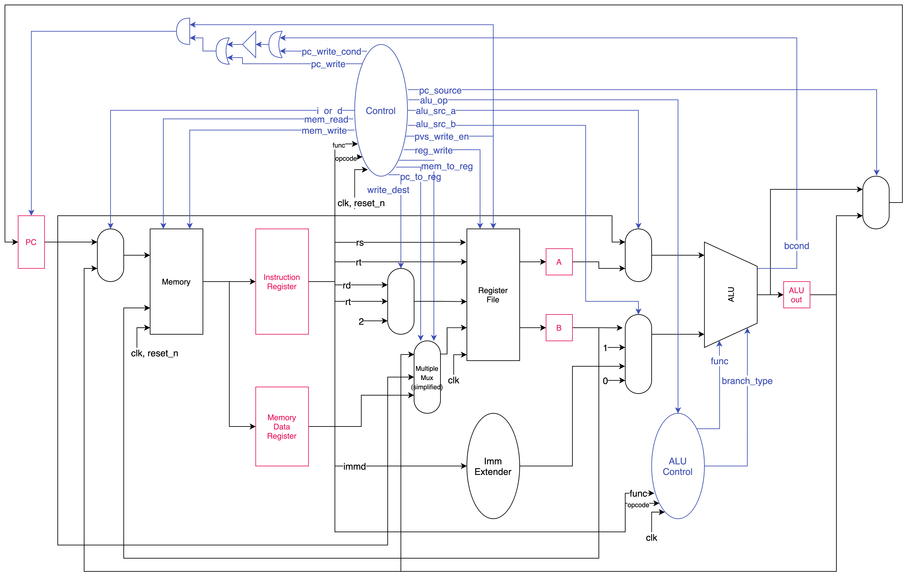

Lab 4: Multi Cycle CPU
===
20190084 권민재, 20190335 양승원 `CSED311`

# Introduction
이번 과제에서는 하나의 명령어가 여러 사이클 동안 작동하는 multi cycle CPU를 구현해야한다. Single cycle cpu는 하나의 명령어가 하나의 사이클 동안 작동하기 때문에 클럭 스피드가 가장 느린 과정에 종속성을 가진다. 반면에 우리는 이번 과제에서 각각의 과정이 각기 다른 사이클을 가지고 실행될 수 있도록 CPU를 디자인 해야 한다. 이번 과제를 통해 multi cycle CPU가 왜 single cycle CPU보다 빠른지 알아볼 수 있을 것이다.

# Design

## Microcode
instruction 내부의 단계마다 특정한 동작을 수행하기 위해, microcode가 필요하다. 어떤 마이크로코드를 실행해야할지 결정하는 microPC는, 직관성을 위해 STATE로 만들어졌다. 명령어에 따라 거치게 되는 STATE에 차이가 있는데, 이것을 combinational logic이 연산하여 next_state로 생성하면 posedge clk의 sequential logic이 current_state로 업데이트한다.  
instruction의 opcode와 funccode를 분석하여 single cycle cpu때와 동일한 instruction classifier들(is_wwd, is_halt, pvs_write_en등만 추가)을 관리한다.  
그러면 current_state와 instruction classifier을 조합하여 control signal을 생성하고, 이것이 output으로 나가 cpu 전체를 조종하게 된다.

## Datapath
### IF
Instruction을 fetch 하는 과정은 사실 MEM 스테이지에서 메모리를 읽는 것과 같은 행위이기 때문에, 해당 리소스를 재활용하여 IF를 핸들링하는 방식을 채택하였다. 메모리의 주소가 들어가는 입력부에 MUX를 이용하여 PC 혹은 ALU의 latch 해 둔 출력값 중 선택할 수 있도록 연결하여 PC 주소의 메모리를 읽어서 출력할 수 있도록 디자인했다.
다만, Memory를 IF 스테이지와 MEM 스테이지에서 재활용하기 때문에 이들을 latch 해 둘 필요성이 있다. 그렇기 때문에, 읽은 instruction이 출력된 이후 클럭의 posedge에서 해당 값을 instruction register에 latch하고, 해당 레지스터로부터 instruction을 이용하는 방식으로 만들어주었다.

### ID
Instruction register에 있는 값을 바탕으로 디코딩을 진행한다. rt, rs, rd를 register file에 연결하여 어떤 레지스터가 대상인지 알 수 있도록 하였다. Register file의 두 출력값도 latch 해주어야 하기 때문에, 그에 상응하는 레지스터를 만들어주고 클럭이 posedge일때 쓰일 수 있도록 디자인하였다.
또한, 이 단계에서는 Control Signal도 어느정도 정해져야하기 때문에 instruction의 정보를 컨트롤 유닛에 연결하고, 이 컨트롤 유닛이 제어가 필요한 각 유닛을 제어할 수 있도록 컨트롤 와이어를 유닛과 각 모듈에 연결하도록 하였다.

### EX
이제 ALU 연산을 할 차례인데, ALU 모듈이 주소를 계산하는 역할도 수행할 수 있도록 자원을 재활용 하였다. 이를 위해, ALU의 첫번째 입력이 PC 혹은 첫번째 레지스터의 값 중에서 선택 될 수 있도록 MUX를 배치하였다. ALU의 두번째 입력은 두번째 레지스터의 값, 4, immediate 값 중에서 선택될 수 있도록 디자인 하였다. ALU는 ALU의 결과를 출력할 뿐만 아니라 주어진 입력에 대해서 branch condition을 계산해서 내보내도록 만들었다. 이때, ALU의 결과는 레지스터에 latch 된다.
이 ALU 모듈은 ALU Control에 의해 컨트롤되게 된다. ALU 컨트롤 유닛은 Instruction과 메인 컨트롤 유닛으로부터 정보를 전달 받아서 각 경우에 대해 ALU가 어떤 연산을 해야할 지 지시할 수 있도록 디자인하였다.

### MEM
MEM 스테이지에서 Memory는 앞서 이야기한 것 처럼 IF와 MEM에서 모두 쓰이게 된다. 그래서 앞서 IF에서 소개한 MUX를 이용하여 MEM이 이용할 메모리 주소를 메모리에 알려주고, write 할 데이터는 Register File의 두번째 레지스터 값을 이용하게 된다. 이때, Memory가 IF 단계와 MEM 단계에서 모두 이용되어야 하기 때문에 값을 latch할 필요성이 있으며, 그렇기 때문에 Memory Register를 만들어서 PC에서 읽은 값이 아닐 때 메모리에서 읽은 값을 latch할 수 있도록 만들었다.

### WB
Write Back을 수행하기 위해서 앞서 ID 스테이지의 register file에 적을 값이 ALU의 결과 값이나 Memory를 읽은 결과 중에서 선택될 수 있도록 MUX를 장착해주어야 한다. Register file에 인가되는 제어 신호를 통해 레지스터에 값을 쓸 수 있도록 설정해줄 것이다.

### Branch/Jump
마지막으로, 우리는 명령어에 따라서 PC를 PC+1 또는 임의의 값으로 변경할 수 있어야 하기 때문에, PC에 업데이트 될 값이 ALU의 결과값과 기존에 latch 되어 있었던 ALU의 결과 값 중에 선택될 수 있도록 만들어주었고, 메인 컨트롤 유닛의 여러 와이어를 조합해서 PC에 어떤 값을 쓸지 그 여부를 결정하도록 디자인하였다.

# Implementation
## Microcode

| STATE\Inst | R-type   | ADI,ORI  | LHI      | load     | store    |
| --------   | -------- | -------- | -------- | -------- | -------- |
| IF_1       | next     | next     | next     | next     | next     |
| IF_2       | next     | next     | to EX_1  | next     | next     |
| ID         | next     | next     | -------- | next     | next     |
| EX_1       | to WB    | to WB    | to WB    | to MEM_1 | to MEM_1 |
| EX_2       | -------- | -------- | -------- | -------- | -------- |
| MEM_1      | -------- | -------- | -------- | next     | next     |
| MEM_2      | -------- | -------- | -------- | next     | to IF_1  |
| WB         | to IF_1  | to IF_1  | to IF_1  | to IF_1  | -------- |

| STATE\Inst | branch not taken | branch taken | JMP,JAL(jrel)| JPR,JRL(jreg)| wwd      | halt       |
| --------   | --------         | --------     | --------     | --------     | -------- | --------   | 
| IF_1       | next             |  next        | next         | next         | next     | next       |
| IF_2       | next             |  next        | to EX_1      | next         | next     | to IF_1    |
| ID         | next             |  next        | --------     | next         | next     | --------   |
| EX_1       | to IF_1          |  next        | next         | next         | to IF_1  | --------   |
| EX_2       | --------         |  to IF_1     | to IF_1      | to IF_1      | -------- | --------   |
| MEM_1      | --------         |  --------    | --------     | --------     | -------- | --------   |
| MEM_2      | --------         |  --------    | --------     | --------     | -------- | --------   |
| WB         | --------         |  --------    | --------     | --------     | -------- | --------   |

- R-type  
  -- IF_1  : `IR <- MEM[PC]`  
  -- IF_2  : `wait`  
  -- ID    : `A <- RF[rs(IR)]` `B <- RF[rt(IR)]` `ALUOut <- PC+1`  
  -- EX_1  : `ALUOut <- A op B`  
  -- EX_2  :   
  -- MEM_1 :   
  -- MEM_2 :   
  -- WB    : `RF[rd(IR)] <- ALUOut` `PC <- PC + 1`

- ADI, ORI (itype: except LHI, load, store, branch)  
  -- IF_1  : `IR <- MEM[PC]`  
  -- IF_2  : `wait`  
  -- ID    : `A <- RF[rs(IR)]` `B <- RF[rt(IR)]` `ALUOut <- PC+1`  
  -- EX_1  : `ALUOut <- op(A,IMMD)`  
  -- EX_2  :   
  -- MEM_1 :   
  -- MEM_2 :   
  -- WB    : `RF[rd(IR)] <- ALUOut` `PC <- PC + 1`

- LHI  
  -- IF_1  : `IR <- MEM[PC]`  
  -- IF_2  : `wait`  
  -- ID    :   
  -- EX_1  : `ALUOut <- LHI(IMMD)`  
  -- EX_2  :   
  -- MEM_1 :   
  -- MEM_2 :   
  -- WB    : `RF[rd(IR)] <- ALUOut` `PC <- PC + 1`

- Load  
  -- IF_1  : `IR <- MEM[PC]`  
  -- IF_2  : `wait`  
  -- ID    : `A <- RF[rs(IR)]` `B <- RF[rt(IR)]` `ALUOut <- PC+1`  
  -- EX_1  : `ALUOut <- A + IMMD`  
  -- EX_2  :   
  -- MEM_1 : `MDR <- MEM[ALUOut]`  
  -- MEM_2 : `wait`  
  -- WB    : `RF[rd(IR)] <- MDR` `PC <- PC + 1`

- Store  
  -- IF_1  : `IR <- MEM[PC]`  
  -- IF_2  : `wait`  
  -- ID    : `A <- RF[rs(IR)]` `B <- RF[rt(IR)]` `ALUOut <- PC+1`  
  -- EX_1  : `ALUOut <- A + IMMD`  
  -- EX_2  :   
  -- MEM_1 : `MEM[ALUOut] <- B`  
  -- MEM_2 : `wait`  
  -- WB    :

- Branch (not taken)  
  -- IF_1  : `IR <- MEM[PC]`  
  -- IF_2  : `wait`  
  -- ID    : `A <- RF[rs(IR)]` `B <- RF[rt(IR)]` `ALUOut <- PC+1`  
  -- EX_1  : `C <- A-B` `bcond <- btype(A,C)` `PC <- ALUOut`  
  -- EX_2  :   
  -- MEM_1 :   
  -- MEM_2 :   
  -- WB    :

- Branch (taken)  
  -- IF_1  : `IR <- MEM[PC]`  
  -- IF_2  : `wait`  
  -- ID    : `A <- RF[rs(IR)]` `B <- RF[rt(IR)]` `ALUOut <- PC+1`  
  -- EX_1  : `C <- A-B` `bcond <- btype(A,C)`  
  -- EX_2  : `PC <- OFT(PC, IMMD)`  
  -- MEM_1 :   
  -- MEM_2 :   
  -- WB    :

- JMP (jrel & !jwrite)  
  -- IF_1  : `IR <- MEM[PC]`  
  -- IF_2  : `wait`  
  -- ID    :   
  -- EX_1  : `ALUOut <- TGT(A,imm)`  
  -- EX_2  : `PC <- ALUOut`  
  -- MEM_1 :   
  -- MEM_2 :   
  -- WB    :

- JAL (jrel & jwrite)  
  -- IF_1  : `IR <- MEM[PC]`  
  -- IF_2  : `wait`  
  -- ID    :   
  -- EX_1  : `ALUOut <- TGT(A,imm)` `RF[$2] <- PC`  
  -- EX_2  : `PC <- ALUOut`  
  -- MEM_1 :   
  -- MEM_2 :   
  -- WB    :

- JPR (jreg & !jwrite)  
  -- IF_1  : `IR <- MEM[PC]`  
  -- IF_2  : `wait`  
  -- ID    : `A <- RF[rs(IR)]` `B <- RF[rt(IR)]` `ALUOut <- PC+1`  
  -- EX_1  : `ALUOut <- IDN(A)`  
  -- EX_2  : `PC <- ALUOut`  
  -- MEM_1 :   
  -- MEM_2 :   
  -- WB    :

- JMP (jreg & jwrite)  
  -- IF_1  : `IR <- MEM[PC]`  
  -- IF_2  : `wait`  
  -- ID    : `A <- RF[rs(IR)]` `B <- RF[rt(IR)]` `ALUOut <- PC+1`  
  -- EX_1  : `ALUOut <- IDN(A)` `RF[$2] <- PC`  
  -- EX_2  : `PC <- ALUOut`  
  -- MEM_1 :   
  -- MEM_2 :   
  -- WB    :

- WWD  
  -- IF_1  : `IR <- MEM[PC]`  
  -- IF_2  : `wait`  
  -- ID    : `A <- RF[rs(IR)]` `B <- RF[rt(IR)]` `ALUOut <- PC+1`  
  -- EX_1  : `output_port <- A` `wwd <- TRUE` `PC <- ALUOut`  
  -- EX_2  :   
  -- MEM_1 :   
  -- MEM_2 :   
  -- WB    :

- Halt  
  -- IF_1  : `IR <- MEM[PC]`  
  -- IF_2  : `halt <- TRUE`  
  -- ID    :   
  -- EX_1  :   
  -- EX_2  :   
  -- MEM_1 :   
  -- MEM_2 :   
  -- WB    :

TGT은 jump target address를, OFT은 branch address를 연산한다. IDN은 A를 그대로 반환한다.

## Datapath
기본적으로는 위의 디자인을 따랐으나, 구현하면서 달라진 것을 위주로 아래에 서술하였다.

### EX
기존 ALU에서 기본적인 사칙연산만 다뤘던 것에 비해, 더 복잡한 연산을 지원하게 구현하였다. TSC에서는 브랜치 주소 계산을 특이하게 하기 때문에, resource-reuse의 관점에서 해당 연산을 ALU에서 수행할 수 있도록 FUNC_TGT, FUNC_OFT와 같은 func code에 대응되는 연산을 구현하였다. 또한, branch type에 따라서 bcond를 설정하도록 설정하였다.

### MEM
그림에서 메모리 입력과 출력 와이어가 따로 설정되어 있는 것과 달리, 실제에서는 하나의 라인을 이용한다. 메모리의 데이터 포트가 inout이기 때문에, assign을 이용하여 와이어를 할당시켜놓고, 상황에 따라 read 혹은 write로 쓸 수 있도록 구현하였다.

# Discussion
- TSC에서는 jump할 주소를 특이한 concat으로 구하는데, 자원을 최대한 재활용하기 위해서 이 또한 ALU에서 처리하도록 구현하였다.
- 4개의 Jump instruction은 jrel인지 jreg인지, jwrite인지 아닌지의 두 가지 기준으로 분류될 수 있는데, 이것을 control signal을 이용해 기준별로 구분하여 사이클을 진행하도록 만들었다.
- 주어진 조건대로, Register Write나 Memory Write, STATE Write는 모두 clock syncronized되어 posedge에서만 업데이트되도록 하였다.

# Conclusion
이번 과제를 통해 명령어가 수행되는 각 과정에 있어서 걸리는 사이클을 각기 다르게 설정함으로써 기존의 single cycle CPU에 비해 높은 성능을 얻을 수 있음을 알 수 있었다. 이전 single-cycle cpu에 비해 같은 양의 일을 더 적은 시간에 처리하는 것을 관찰할 수 있었기 때문이다. 앞으로 pipeline을 통해 CPU를 개선하여 더 좋은 성능을 가질 수 있도록 할 필요성이 있다.