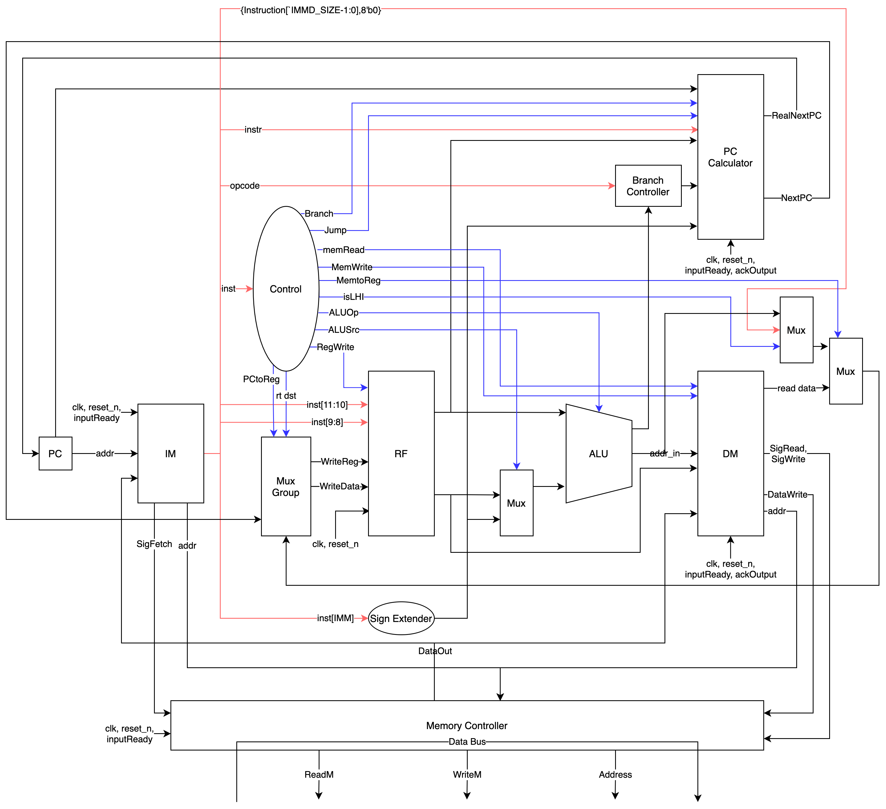
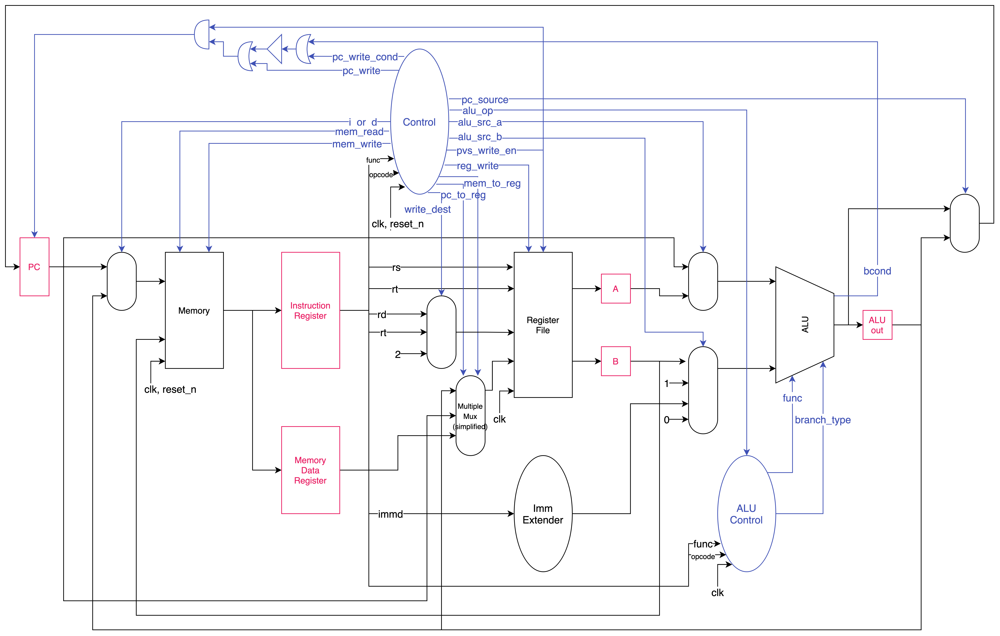

# Computer Architecture

**Computer Architecture** is the science and art of selecting and interconnecting hardware components to create a computer that meets functional, performance, and cost goals. This course introduces the basic principles and hardware structures of a modern general-purpose computer. We will learn, for example, how to design the control and datapath for a pipelined RISC processor and how to design fast memory and storage systems. The principles presented in the lectures are reinforced in the laboratory through designing and implementing a RISC processor in Register Transfer-Level (RTL) using Verilog HDL.

## Assignments
### ALU
[Link](Lab/Lab01)

### RTL Design
Simple vending machine FSM implementation with Verilog.
[Link](Lab/Lab01)

### Single Cycle CPU

[Link](Lab/Lab03)

### Multi Cycle CPU

[Link](Lab/Lab04)